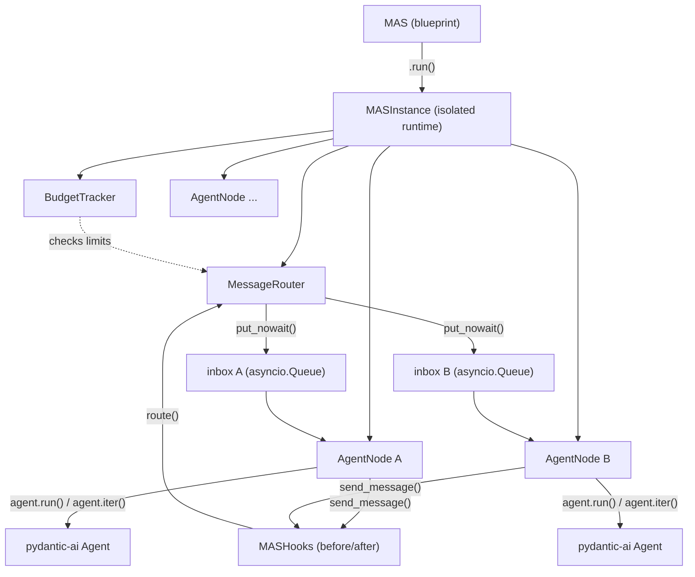

# pydantic-mas

A peer-to-peer multi-agent system framework built on [pydantic-ai](https://github.com/pydantic/pydantic-ai).

Agents communicate by sending messages to each other via a `send_message` tool that is automatically injected at runtime. Each agent runs as an independent asyncio task with its own inbox, conversation history, and state.

## Installation

```bash
pip install pydantic-mas
```

Or with [uv](https://docs.astral.sh/uv/):

```bash
uv add pydantic-mas
```

## Quick Start

```python
import asyncio
from pydantic_ai import Agent
from pydantic_mas import MAS, AgentConfig, Budget

researcher = Agent(
    "openai:gpt-5.4",
    system_prompt="You are a researcher. Use send_message to delegate writing tasks to 'writer'.",
)
writer = Agent(
    "openai:gpt-5.4",
    system_prompt="You are a writer. Write concise content based on instructions.",
)

mas = MAS(
    agents={
        "researcher": AgentConfig(agent=researcher),
        "writer": AgentConfig(agent=writer),
    },
    budget=Budget(max_total_messages=20, timeout_seconds=30),
)

result = asyncio.run(
    mas.run(entry_agent="researcher", prompt="Write a summary of quantum computing.")
)

print(f"Termination: {result.termination_reason}")
print(f"Messages exchanged: {len(result.message_log)}")
for msg in result.message_log:
    print(f"  {msg.sender} -> {msg.receiver}: {msg.content[:80]}")
```

## Core Concepts

### MAS

The top-level blueprint. Holds agent configurations and system-wide settings. Each `.run()` call creates a fresh, isolated runtime.

```python
mas = MAS(
    agents={"agent_a": AgentConfig(agent=...), "agent_b": AgentConfig(agent=...)},
    budget=Budget(max_total_messages=50, max_depth=5, timeout_seconds=60),
    interrupt_on_send=True,  # stop agent after it sends a message
)
```

### AgentConfig

Pairs a pydantic-ai `Agent` with its dependencies. Dependencies can be static or created fresh per run via a factory.

```python
# Static deps
AgentConfig(agent=my_agent, deps=my_database_client)

# Fresh deps per run
AgentConfig(agent=my_agent, deps_factory=lambda: DatabaseClient())
```

### send_message

Every agent automatically gets a `send_message(target_agent, content)` tool injected at runtime. This is how agents communicate. Developer-defined tools on the agent are preserved.

```python
# The agent's LLM can call:
# send_message(target_agent="writer", content="Please write an intro paragraph")
```

### Budget

Controls resource consumption at the MAS level:

```python
Budget(
    max_total_messages=100,    # total messages across all agents
    max_agent_messages=20,     # per-agent message limit
    max_depth=10,              # max message chain depth
    timeout_seconds=60,        # wall-clock timeout
)
```

### MASResult

Returned by `mas.run()`, contains everything about the execution:

```python
result = await mas.run(entry_agent="researcher", prompt="...")

result.termination_reason   # TerminationReason.COMPLETED | .TIMEOUT | .BUDGET_EXCEEDED
result.message_log          # list[Message] - all messages exchanged
result.agent_histories      # dict[str, list[ModelMessage]] - per-agent LLM histories
result.budget_usage         # BudgetSnapshot - message counts, depth stats
```

### Interrupt-on-Send

When `interrupt_on_send=True`, an agent that calls `send_message` is stopped after the tool-call turn completes. This prevents the LLM from taking additional turns after delegating work, giving the receiving agent a chance to respond first.

```python
mas = MAS(
    agents={...},
    interrupt_on_send=True,
)
```

All tools in a turn still execute before the interrupt. The agent's conversation history is preserved so it has full context when it processes the next message.

### Shared State

Agents can share mutable state via deps or tool closures. Since all agents run in a single asyncio event loop and message routing is synchronous, there are no race conditions for synchronous mutations.

```python
class SharedReport:
    def __init__(self):
        self.sections: list[str] = []

report = SharedReport()

mas = MAS(
    agents={
        "researcher": AgentConfig(agent=researcher, deps=report),
        "writer": AgentConfig(agent=writer, deps=report),
    },
)
```

### Communication Hooks

Intercept `send_message` calls with before/after hooks for logging, access control, content filtering, or message transformation.

```python
from pydantic_mas import MASHooks, SendMessageHookContext, Message

# Log all inter-agent communication
async def log_messages(ctx: SendMessageHookContext, msg: Message) -> None:
    print(f"{ctx.sender_id} -> {ctx.receiver_id}: {ctx.content[:80]}")

# Block unauthorized communication
async def access_control(ctx: SendMessageHookContext) -> SendMessageHookContext | None:
    allowed = {"researcher": ["writer"], "writer": ["researcher"]}
    if ctx.receiver_id not in allowed.get(ctx.sender_id, []):
        return None  # block the message
    return ctx

# Modify outgoing content
async def add_metadata(ctx: SendMessageHookContext) -> SendMessageHookContext:
    ctx.content = f"[priority: high] {ctx.content}"
    return ctx

mas = MAS(
    agents={...},
    hooks=MASHooks(
        before_send_message=access_control,  # can modify or block (return None)
        after_send_message=log_messages,     # observe only (message already delivered)
    ),
)
```

### Custom Message Formatter

Control how incoming messages are presented to the LLM:

```python
from pydantic_mas import Message

def my_formatter(message: Message) -> str:
    return f"From {message.sender}: {message.content}"

mas = MAS(agents={...}, message_formatter=my_formatter)
```

## Architecture



Each `AgentNode` runs as an asyncio task. When an agent calls `send_message`, the router synchronously delivers the message to the target agent's inbox queue. The system terminates when all agents are idle with empty queues, the budget is exceeded, or a timeout fires.

## Requirements

- Python 3.12+
- pydantic-ai >= 1.80.0

## License

MIT
